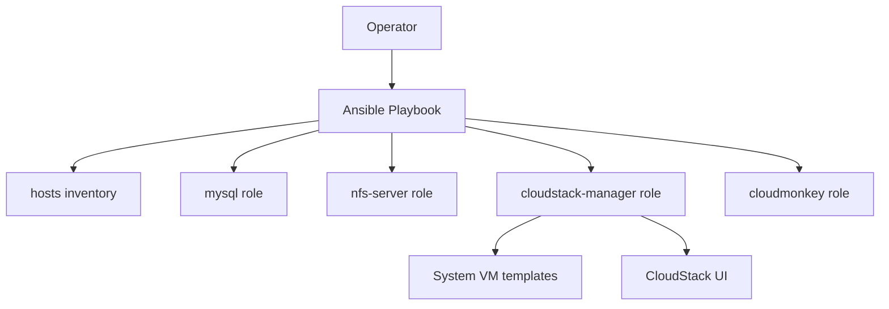

# CloudStack Installer

Ansible playbook for deploying an Apache CloudStack management environment on Ubuntu 22.04 LTS.

The project focuses on repeatable lab and single-host deployments where CloudStack, database, NFS storage, system VM templates, and CloudMonkey are prepared through Ansible roles.


## Overview

This repository provides a CloudStack management server deployment playbook.

It can install the following components:

- Apache CloudStack Management Server.
- MySQL/MariaDB database when `install_local_db=true`.
- NFS server for primary/secondary storage.
- System VM templates for KVM and XenServer.
- CloudMonkey CLI.

The default inventory targets the `acs-manager` group. For local lab usage, this can point to `127.0.0.1` with `ansible_connection=local`; for remote hosts, replace it with the target host IP address or FQDN.

## Architecture



## Requirements

- Ubuntu 22.04 LTS target host.
- Ansible installed on the control machine.
- SSH access to the target host, or local execution configured in the inventory.
- Recommended hardware for lab usage:
  - 4 CPU/vCPU.
  - 4 GB RAM or more.
  - 250 GB disk or more.
  - 1 Gb network connectivity or better.

Install the basic Ansible requirements:

```bash
sudo apt update
sudo apt install -y ansible sshpass
```

If you use password-based SSH, disable host key checking for the run or configure it appropriately in your Ansible configuration.

## Quick start

Clone the repository:

```bash
git clone https://github.com/arencibiafrancisco/cloudstack-installer.git
cd cloudstack-installer
```

Review the inventory:

```ini
[acs-manager]
127.0.0.1 ansible_connection=local
```

Run a local database deployment:

```bash
ansible-playbook deploy-cloudstack.yml \
  -i hosts \
  -k \
  -u root \
  -e "mysql_root_password=<secure-root-password> mysql_cloud_password=<secure-cloud-password> cloudstack_release=4.19 cloudstack_systemvmtemplate=4.19.1 install_local_db=true"
```

## External database examples

Deploy a CloudStack master node using an existing database endpoint:

```bash
ansible-playbook deploy-cloudstack.yml \
  -i hosts \
  -k \
  -u root \
  -e "mysql_root_password=<secure-root-password> mysql_cloud_password=<secure-cloud-password> cloudstack_release=4.19 cloudstack_systemvmtemplate=4.19.1 nodetype=master db_endpoint=<database-endpoint>"
```

Deploy a CloudStack slave node:

```bash
ansible-playbook deploy-cloudstack.yml \
  -i hosts \
  -k \
  -u root \
  -e "mysql_cloud_password=<secure-cloud-password> cloudstack_release=4.19 cloudstack_systemvmtemplate=4.19.1 nodetype=slave db_endpoint=<database-endpoint>"
```

## Configuration

The main runtime variables are passed to `deploy-cloudstack.yml`:

| Variable | Description | Example |
| --- | --- | --- |
| `mysql_root_password` | Root password used when configuring the local database or master database flow. | `<secure-root-password>` |
| `mysql_cloud_password` | CloudStack database password. | `<secure-cloud-password>` |
| `cloudstack_release` | CloudStack release used by package/template URLs. | `4.19` |
| `cloudstack_systemvmtemplate` | System VM template version. | `4.19.1` |
| `install_local_db` | Installs database locally when set to `true`. | `true` |
| `nodetype` | Node role for external database scenarios. | `master` or `slave` |
| `db_endpoint` | External database endpoint. | `10.35.10.78` |

Prefer passing sensitive values through Ansible Vault, CI secrets, or local environment-specific files that are not committed to Git.

## Project structure

```text
.
├── deploy-cloudstack.yml
├── hosts
└── roles
    ├── cloudmonkey
    ├── cloudstack-manager
    ├── mysql
    └── nfs-server
```

## Roadmap

- Add Ansible linting and syntax validation in CI.
- Add example inventories for local and remote deployments.
- Add troubleshooting notes for package repositories, networking, and system VM templates.
- Add diagrams for storage and CloudStack component flow.

## Contributing

Issues and pull requests are welcome. Please include:

- Clear reproduction steps or deployment context.
- Target OS and Ansible version.
- Relevant playbook output with secrets removed.

## Security

Do not commit real passwords, private keys, inventory files with sensitive host data, or generated credentials.

If you discover a security issue, avoid publishing sensitive details in a public issue. Contact the maintainer privately first.

## License

No license file is currently published in this repository. Add a license before promoting the project as open source.
